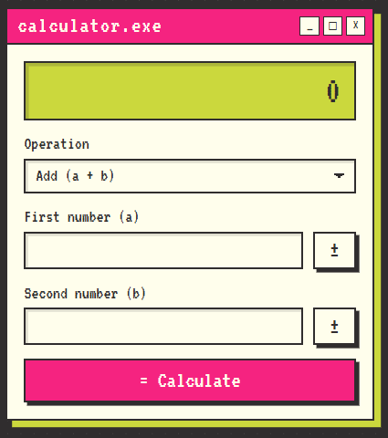

# Sezzle Calculator

A full-stack calculator: a **React + TypeScript** frontend that consumes a **Go** REST microservice. It supports addition, subtraction, multiplication and division, plus all three optional operations: exponentiation, square root and percentage.

<p align="center">
  
</p>

## Contents

- [Tech stack](#tech-stack)
- [Project structure](#project-structure)
- [Getting started](#getting-started)
- [Running the tests](#running-the-tests)
- [Coverage](#coverage)
- [API reference](#api-reference)
- [Design decisions](#design-decisions)
- [Assumptions](#assumptions)
- [Known limitations and next steps](#known-limitations-and-next-steps)
- [AI usage](#ai-usage)

## Tech stack

| Layer | Technology |
|---|---|
| Backend | Go, standard library only (`net/http` with Go 1.22+ routing patterns) |
| Frontend | React, TypeScript, Vite |
| Tests | Go `testing` + `httptest`; Vitest + React Testing Library |

## Project structure

```
.
├── backend/
│   ├── cmd/server/           # Entry point: HTTP server, timeouts, graceful shutdown
│   └── internal/
│       ├── calculator/       # Pure arithmetic logic, no HTTP
│       └── api/              # HTTP layer: routing, JSON decoding, validation, error mapping
├── frontend/
│   └── src/
│       ├── api.ts            # Typed API client
│       ├── numbers.ts        # Input parsing, sign toggle, result formatting
│       ├── operations.ts     # Operation catalog used by the UI
│       ├── Calculator.tsx    # Calculator form component
│       └── App.tsx           # App shell (retro window)
└── PROMPTS.md                # Log of AI prompts used during development
```

## Getting started

### Prerequisites

- **Go**: the version in `backend/go.mod` (developed with Go 1.27)
- **Node.js** and npm (developed with Node 24)

### Run the backend

```bash
cd backend
go run ./cmd/server
```

The server listens on port `8080` by default. Set the `PORT` environment variable to change it.

### Run the frontend

In a second terminal:

```bash
cd frontend
npm install
npm run dev
```

Open <http://localhost:5173>. In development, Vite proxies every `/api` request to `http://localhost:8080`, so the backend must be running.

## Running the tests

### Backend

```bash
cd backend
go test ./... -cover

# Optional HTML report
go test ./... -coverprofile=coverage.out
go tool cover -html=coverage.out -o coverage.html
```

### Frontend

```bash
cd frontend
npm test              # run once
npm run test:watch    # watch mode
npm run coverage      # coverage summary + HTML report in frontend/coverage/
npm run lint
```

## Coverage

| Layer | Package / scope | Statements | Branches |
|---|---|---|---|
| Backend | `internal/calculator` | 100% | n/a |
| Backend | `internal/api` | 100% | n/a |
| Frontend | `src/` | 100% | 98.3% |

Generated HTML reports are not committed; the commands above regenerate them.

**Excluded on purpose:** `backend/cmd/server` and `frontend/src/main.tsx`. They only wire the application together (start the server, mount React) and contain no logic worth unit testing. The only uncovered frontend branch is a defensive fallback in `Calculator.tsx` that cannot be reached, because the operation always comes from the operation catalog.

**Coverage is not correctness.** During development, the API package reported 100% coverage while square root still rejected requests without `b`. The table-driven handler tests caught it; the coverage number did not.

## API reference

### Endpoint

```
POST /api/{operation}
Content-Type: application/json
```

| Operation | Formula | Requires `b` |
|---|---|---|
| `add` | a + b | yes |
| `subtract` | a − b | yes |
| `multiply` | a × b | yes |
| `divide` | a ÷ b | yes |
| `power` | a ^ b | yes |
| `percentage` | a% of b = a × b / 100 | yes |
| `sqrt` | √a | no (ignored if sent) |

### Request and response

```json
// Request
{ "a": 2, "b": 3 }

// Success: 200
{ "result": 5 }

// Error: 4xx / 5xx
{ "error": "human-readable message" }
```

Every response, including errors from unknown routes, is JSON.

### Status codes

| Code | Meaning | Examples |
|---|---|---|
| 200 | Success | `{"a": 2, "b": 3}` on `/api/add` |
| 400 | Malformed request | Invalid JSON, empty body, a string instead of a number, unknown field, missing `a` or `b`, more than one JSON value, body over 1 KB, number outside float64 range |
| 404 | Not found | Unknown operation (`/api/modulo`), any other path under `/api/` |
| 405 | Method not allowed | `GET /api/add` (response includes `Allow: POST`) |
| 422 | Mathematically invalid | Division by zero, square root of a negative number, result overflows to ±Inf or is NaN |
| 500 | Unexpected error | Generic message; internal details are never exposed |

### Examples

```bash
# Addition
curl -X POST http://localhost:8080/api/add \
  -H "Content-Type: application/json" \
  -d '{"a": 2, "b": 3}'
# {"result":5}

# Square root: only "a" is needed
curl -X POST http://localhost:8080/api/sqrt \
  -H "Content-Type: application/json" \
  -d '{"a": 9}'
# {"result":3}

# Percentage: 50% of 200
curl -X POST http://localhost:8080/api/percentage \
  -H "Content-Type: application/json" \
  -d '{"a": 50, "b": 200}'
# {"result":100}

# Division by zero: 422
curl -i -X POST http://localhost:8080/api/divide \
  -H "Content-Type: application/json" \
  -d '{"a": 1, "b": 0}'
# HTTP/1.1 422 Unprocessable Entity
# {"error":"division by zero"}

# Missing field: 400
curl -i -X POST http://localhost:8080/api/add \
  -H "Content-Type: application/json" \
  -d '{"a": 1}'
# HTTP/1.1 400 Bad Request
# {"error":"request body must be a JSON object with numeric fields"}

# Unknown operation: 404
curl -i -X POST http://localhost:8080/api/modulo \
  -H "Content-Type: application/json" \
  -d '{"a": 1, "b": 2}'
# HTTP/1.1 404 Not Found
# {"error":"unknown operation: modulo"}
```

> **Windows (cmd):** single quotes don't work. Escape the inner quotes instead:
> `curl -X POST http://localhost:8080/api/add -H "Content-Type: application/json" -d "{\"a\": 2, \"b\": 3}"`

## Design decisions

### Backend

- **Standard library only.** Go 1.22+ routing patterns (`POST /api/{operation}`) cover everything this service needs: method matching and path parameters. A framework would add a dependency without adding capability.
- **Layered packages.** `calculator` is pure logic with no knowledge of HTTP, so it can be tested in isolation. `api` translates between HTTP and that logic. `cmd/server` only wires things together.
- **Sentinel errors mapped to status codes.** The calculator returns `ErrDivisionByZero`, `ErrNegativeSqrt` and `ErrInvalidResult`. The HTTP layer maps them to 422 with `errors.Is`. Any other error becomes a generic 500, so internal details never leak.
- **Operation registry.** Operations live in a map (name → function + whether `b` is required). Adding an operation means adding one entry; the handler does not change.
- **One endpoint per operation**, `POST /api/{operation}`, rather than a single endpoint with the operation in the body. The URL says what happens, and an unknown operation is naturally a 404.
- **400 vs 422.** 400 means the request itself is malformed. 422 means the request is well-formed but the operation is mathematically undefined. This lets the client tell "fix your input format" apart from "this calculation has no answer".
- **Strict input validation.**
  - Fields are `*float64`, which distinguishes a missing field from an explicit `0`.
  - Unknown fields are rejected.
  - Data after the first JSON value is rejected (`{"a":1,"b":2}{"a":3}` returns 400; Go's decoder would otherwise silently ignore it).
  - The body is capped at 1 KB.
- **Errors are always JSON.** Go's default 404 and 405 responses are plain text, so catch-all handlers return JSON errors and keep the contract consistent for clients.
- **Production-minded server.** Explicit read, write and idle timeouts (Go's defaults have none, which leaves the server open to slow-client attacks), plus graceful shutdown on SIGINT/SIGTERM.
- **float64 numbers.** Simple and native to both JSON and JavaScript. The trade-off is binary floating-point precision (`0.1 + 0.2 = 0.30000000000000004`). Arbitrary-precision decimals (e.g. `math/big`) were considered unnecessary for a general-purpose calculator; the UI rounds the displayed value instead (see below).

### Frontend

- **Form-based UI.** Two operand fields and an operation selector map one-to-one to the API contract, and make validation errors visible next to the field that caused them. The second field is hidden for square root.
- **Validation split.** The frontend validates format only (required, numeric, one decimal separator). The backend is the single source of truth for mathematical rules: a 422 message such as division by zero is displayed as returned. No rule is duplicated in two languages.
- **`type="text"` with `inputMode="decimal"`** instead of `type="number"`. A number input reports an empty value for invalid text, so the app couldn't tell "empty" from "invalid", and it accepts characters like `e` anywhere. The text input still opens the numeric keypad on mobile.
- **Mobile keypad support.**
  - The decimal keypad types a comma on Spanish and other locales, so both `.` and `,` are accepted as decimal separators.
  - iOS's decimal keypad has no minus key, so each field has a **±** button. On an empty field it inserts `-` so the user can type a negative number.
- **Display rounding.** Results are rounded to 12 significant digits for display only (`0.1 + 0.2` shows `0.3`). The API still returns the exact float64 value; formatting is a presentation concern.
- **Typed API client.** All HTTP calls go through `api.ts`. Responses are typed as `unknown` and checked before use, and network failures, non-JSON responses, backend errors and unexpected shapes each produce a clear message.
- **Accessibility.** Labeled inputs, `aria-invalid` and `aria-describedby` for field errors, a live region for results and `role="alert"` for errors. Tests query elements by role and label, the same way assistive technology finds them.
- **Visual design.** A retro window theme using my personal brand palette (`#cbd83d`, `#f52380`, `#302d2e`, `#fffeec`) and the VT323 pixel font, bundled locally via `@fontsource` so it works offline. The theme is fixed on purpose (no dark mode). Pink, the lowest-contrast color, is used only for large text, borders and focus rings; small text always uses the dark ink color.
- **No CORS configuration.** In development, the Vite proxy makes API calls same-origin.

### Testing strategy

| Layer | What is tested | How |
|---|---|---|
| `calculator` | Every operation and edge case | Table-driven unit tests |
| `api` | Routing, decoding, validation, status codes, JSON error bodies | Table-driven tests through the real router with `httptest`; an internal test checks that 500s don't leak details |
| `numbers.ts` | Parsing, sign toggle, formatting | Table-driven (`it.each`) |
| `api.ts` | Mapping of HTTP responses and failures to results or errors | `fetch` mocked |
| `Calculator.tsx` | User behavior: typing, validation messages, results, loading state | React Testing Library + user-event, API module mocked |

Each layer is tested at its boundary. There is no automated end-to-end test across the real frontend and backend; that path was verified manually.

## Assumptions

- **Percentage** means "a percent of b": `a × b / 100`.
- **Square root** uses only `a`; a `b` value is accepted and ignored.
- The API accepts any JSON number. The UI accepts plain decimal numbers only: no scientific notation and no thousands separators.
- Results are returned as raw float64 values; rounding happens only in the UI.
- The UI is in English.

## Known limitations and next steps

- **Docker:** [TODO: remove this line if the Dockerfile ships]
- **End-to-end tests** (e.g. Playwright) to cover the real frontend-backend integration.
- **Request logging** and basic metrics in the backend.
- **Arbitrary-precision arithmetic** if exact decimal results are ever required.

## AI usage

I used AI assistance during development. The prompts are logged in [PROMPTS.md](PROMPTS.md), as the assignment requests.